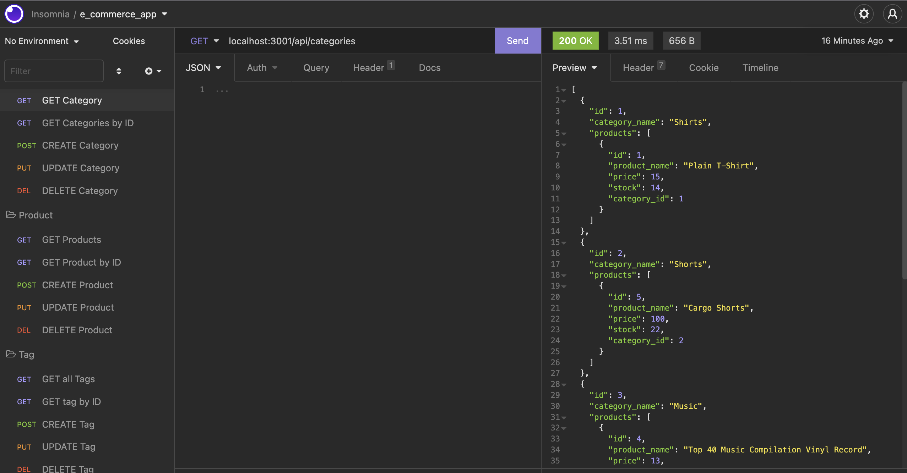

# E-commerce Back End Starter Code

## Contents

  - [User Story](#user_story)
  - [Acceptance Criteria](#acceptance_criteria)
  - [Installation](#installation)
  - [Usage](#usage)
  - [Contributing](#contributing)
  - [Tests](#tests)
  - [License](#license)
  - [Attributions](#attributions)
  - [Questions](#questions)

## User Story

````
AS A manager at an internet retail company
I WANT a back end for my e-commerce website that uses the latest technologies
SO THAT my company can compete with other e-commerce companies
````

## Acceptance Criteria

````
GIVEN a functional Express.js API
WHEN I add my database name, MySQL username, and MySQL password to an environment variable file
THEN I am able to connect to a database using Sequelize
WHEN I enter schema and seed commands
THEN a development database is created and is seeded with test data
WHEN I enter the command to invoke the application
THEN my server is started and the Sequelize models are synced to the MySQL database
WHEN I open API GET routes in Insomnia for categories, products, or tags
THEN the data for each of these routes is displayed in a formatted JSON
WHEN I test API POST, PUT, and DELETE routes in Insomnia
THEN I am able to successfully create, update, and delete data in my database
````

## Installation

Run the following command in your terminal in order to install all the packages:

`npm install`

Run the following commands in get mysql up and running: 

`mysql -u root -p` and enter your password.

Run the following commands in the mysql server: 

1. `source db/schema.sql` to create database.

2. `quit` out of mysql

3. `npm run seed` to seed the database.

Start the node application by running: 

`npm start`

Open application in [Insomnia](https://insomnia.rest/) in order to check routes

## Usage



Link to [walkthrough](https://youtu.be/73yaXTDskzo) video.

## Contributing

In order to contribute, create a pull request and follow the steps listed below:

- Fork the repo
- Create a feature branch (git checkout -b NAME-HERE)
- Commit your new feature (git commit -m 'Add some feature')
- Push your branch (git push)
- Create a new Pull Request

Following a code review, your feature will be merged.

## Tests

No testing protocols were implemented in this application

## License

[](https://opensource.org/licenses/MIT)

This application is licensed under the MIT License.

## Attributions

* [Starter code](https://github.com/coding-boot-camp/fantastic-umbrella) for this project
* [sequelize](https://sequelize.org/docs/v6/getting-started/)
* [mysql2](https://www.npmjs.com/package/mysql2)
* How to use [associations](https://sequelize.org/docs/v6/core-concepts/assocs/) in Sequelize

## Questions

If you have any questions, please contact me at my [email](mailto:leandrikuyk@gmail.com?subject=%20ECommerce%20App). You can find more of my work on my GitHub at [LeandriB](https://github.com/LeandriB). 

